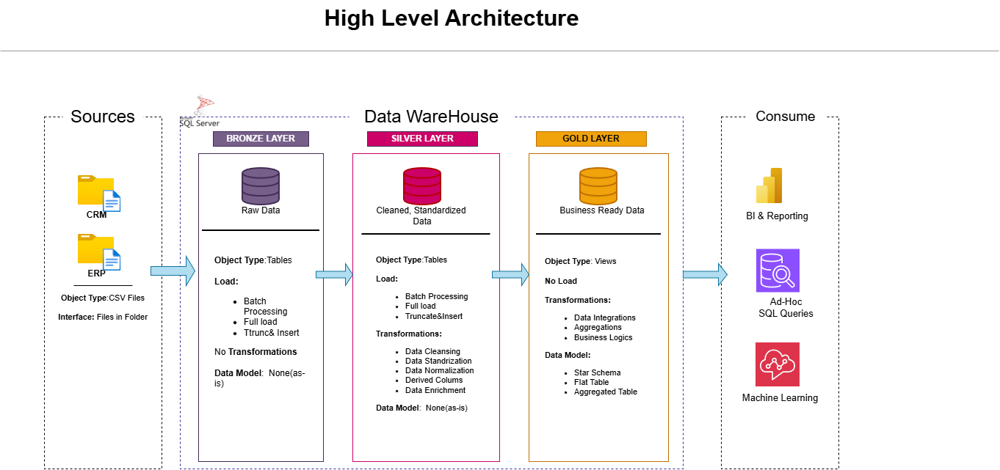

# Data Warehouse and Analytics Project

Welcome to the **Data Warehouse and Analytics Project** repository! 
This project presents an end-to-end data warehousing and analytics solution, covering everything from building the data warehouse to deriving meaningful insights. Developed as a portfolio project, it showcases industry best practices in data engineering and analytics.

---
## 🏗️ Data Architecture

The data architecture for this project follows Medallion Architecture **Bronze**, **Silver**, and **Gold** layers:

1. **Bronze Layer**: Stores raw data as-is from the source systems. Data is ingested from CSV Files into SQL Server Database.
2. **Silver Layer**: This layer includes data cleansing, standardization, and normalization processes to prepare data for analysis.
3. **Gold Layer**: Houses business-ready data modeled into a star schema required for reporting and analytics.

---
## 📖 Project Overview

This project involves:

1. **Data Architecture**: Designing a Modern Data Warehouse Using Medallion Architecture **Bronze**, **Silver**, and **Gold** layers.
2. **ETL Pipelines**: Extracting, transforming, and loading data from source systems into the warehouse.
3. **Data Modeling**: Developing fact and dimension tables optimized for analytical queries.
4. **Analytics & Reporting**: Creating SQL-based reports and dashboards for actionable insights.

---

## 🚀 Project Requirements

### Building the Data Warehouse (Data Engineering)

### Objective
Build a modern SQL Server–based data warehouse to unify sales data and support analytical reporting for better decision-making.

### Specifications
- **Data Sources**: Load data from ERP and CRM systems provided in CSV format.
- **Data Quality**: Clean and standardize data to address quality issues before analysis.
- **Integration**: Merge both sources into a single, user-friendly analytical data model.
- **Scope**: Work with the most recent data only; historical tracking is not required.
- **Documentation**: Create clear and structured documentation to support business users and analytics teams.

---

## BI: Analytics & Reporting (Data Analysis)

### Objective
Develop SQL-based analytics to deliver detailed insights into:
- **Customer Behavior**
- **Product Performance**
- **Sales Trends**
  
These insights empower stakeholders with key business metrics, enabling strategic decision-making.

---

## 🛡️ License

This project is licensed under the [MIT License](LICENSE). You are free to use, modify, and share this project with proper attribution.

## 🌟 About Me

Hello there! I'm **Ridhima Doval**. I’m an aspiring data analyst who enjoys working with data, solving problems, and creating insights using SQL, Excel, and Power BI.

